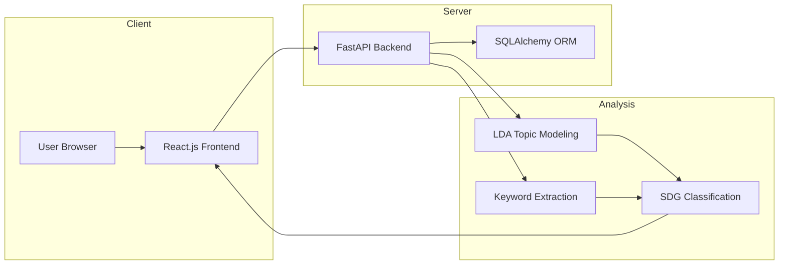

# 🌍 SDGs Mapping Tools

A web application built using the **FastAPI & React Framework** with **SQLAlchemy ORM** to assist in **mapping scientific publications to Sustainable Development Goals (SDGs)** using keyword extraction and topic modeling.

---

## 📌 Project Overview

**SDGs Mapping Tools** is a medium-scale research-oriented application developed for **Pusat Riset Sains Data dan Informasi, BRIN Bandung** to:

- 📤 Upload and process scientific documents
- 🔍 Automatically extract keywords
- 🧠 Perform topic classification and map results to **17 SDGs**
- 📊 Provide interactive visualization of mapping results

**Developed by:**
- 👤 Bimo Kusumo  
- 👤 Yusry Anandita  
- 👤 Evan Adkara

---

## ⚙️ Tech Stack – FastAPI & React + SQLAlchemy

| Component     | Technology                                                                 | Description |
|--------------|-----------------------------------------------------------------------------|-------------|
| **Frontend** | [React.js](https://reactjs.org/)                                            | Fast, responsive, and interactive UI |
| **Backend**  | [FastAPI](https://fastapi.tiangolo.com/)                                    | High-performance API for processing and inference |
| **Database** | [SQLAlchemy](https://www.sqlalchemy.org/)                                   | ORM for structured metadata storage |

---
## 🏗 Minimal Architecture Diagram


---
### Why This Stack?
- **FastAPI**
  - ⚡ Extremely fast with async support
  - 🧪 Interactive API docs (Swagger, ReDoc)
  - 🔐 Type hinting & built-in validation

- **React.js**
  - 🔁 Component-based and reactive
  - 💻 Excellent for building dynamic forms and visualizations
  - 🌐 Works seamlessly with REST APIs

- **SQLAlchemy**
  - 🗄 Compatible with PostgreSQL, MySQL, SQLite
  - 📑 Ideal for structured metadata storage (title, abstract, analysis results)
  - 🛠 Flexible query building and ORM mapping

---

## 📚 Features
- 📝 Upload `.csv`, `.xlsx`, or `.json` documents
- 🧠 Topic modeling (LDA-based)
- 🗂 Automatic keyword extraction
- 🎯 SDG classification via keyword-to-SDG mapping
- 📊 Dashboard with charts & knowledge graph
- 🔍 Document history & delete functionality

---

## 🛠️ Installation & Run

### 1️⃣ Clone the Repository
```bash
git clone https://github.com/ChinChinMarux/SDGsApp.git
cd SDGsApp
```
### 2. Setup Backend
```bash
cd backend
python -m venv venv
.venv\Scripts\activate #or use UV instead
pip install -r requirements.txt
uvicorn main:app --reload
```
### 3. Setup Frontend
```bash
cd frontend
npm install
npm run dev
```
### 4. Setup SQLAlchemy in models.py
```bash
engine = create_engine('sqlite:///(yourdatabasename).db', echo = True)
Base=declarative_base()

## ALL YOUR MODELS HERE##

Base.metadata.create_all(engine)

SessionLocal = sessionmaker(autocommit=False, autoflush=False, bind=engine)

def get_db():
    db = SessionLocal()
    try:
        yield db
    finally:
        db.close()
```

## API Documentation
Swagger UI : http://localhost:8000/docs  
ReDoc      : http://localhost:8000/redoc

## 📈 Future Plans
- ✅ Fine-tuned SDG classifier with machine learning
- 🌐 Multilingual document support
- 🧩 Knowledge graph visualization using SDG ontology
- 🔐 Role-based access control for stakeholders and researchers

## 🤝 Acknowledgements
This project is built in collaboration with the Pusat Riset Sains Data dan Informasi – BRIN Bandung to support national research alignment with the United Nation Sustainable Development Goals (SDGs).
